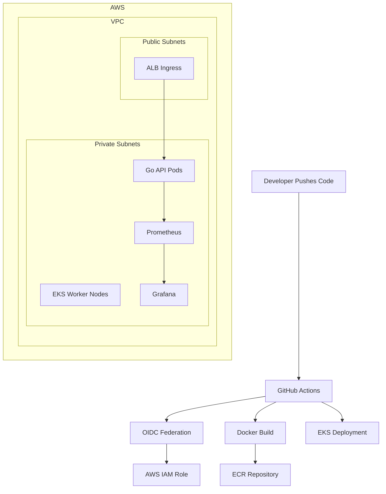

# Production-Grade Cloud-Native Go Microservice Platform on AWS EKS

## Overview

This project demonstrates a production-ready cloud-native backend platform designed using enterprise DevOps and platform engineering practices.

The architecture focuses on:

- High Availability (Multi-AZ EKS)
- Secure CI/CD using GitHub OIDC Federation
- Infrastructure as Code using Terraform
- Kubernetes-native autoscaling and resiliency
- Prometheus + Grafana observability
- Container security hardening
- Immutable deployments and traceability

---

# Tech Stack

| Layer | Technology |
|---|---|
| Backend API | Go (Golang) |
| Containerization | Docker (Distroless Multi-stage Build) |
| Orchestration | Kubernetes (Amazon EKS) |
| Infrastructure as Code | Terraform |
| CI/CD | GitHub Actions |
| Registry | Amazon ECR |
| Observability | Prometheus + Grafana |
| Cloud Provider | AWS |

---

# Architecture Diagram

---

# Key Features

## Application Features

- RESTful Go API
- Graceful shutdown handling
- Health check endpoint
- Native Prometheus metrics exposure
- Optimized HTTP timeouts

## Kubernetes Features

- Horizontal Pod Autoscaler (HPA)
- Readiness and Liveness probes
- Pod Anti-Affinity
- Resource requests and limits
- Zero-trust Network Policies

## CI/CD Features

- GitHub Actions pipeline
- AWS OIDC authentication (No static secrets)
- Docker image build and push
- Automated EKS deployment
- Immutable SHA image tagging

## Security Features

- Distroless container runtime
- Non-root containers
- Private EKS worker nodes
- Least privilege IAM
- Terraform remote encrypted state

---

# Infrastructure Design

## Networking

The infrastructure uses:

- Public subnets for ALB ingress
- Private subnets for worker nodes
- NAT gateways for outbound traffic
- Multi-AZ deployment for HA

This design minimizes attack surface while maintaining scalability and resiliency.

---

# Observability Stack

Prometheus scrapes metrics from the Go application using a ServiceMonitor resource.

Grafana visualizes:

- API request rates
- Pod CPU/Memory usage
- Cluster health
- Application latency

---

# CI/CD Flow

1. Developer pushes code to GitHub
2. GitHub Actions pipeline triggers
3. OIDC federation authenticates to AWS
4. Docker image is built and scanned
5. Image pushed to ECR
6. Kubernetes deployment updated
7. Rolling deployment applied to EKS

---

# Enterprise Enhancements (Future Scope)

Possible future improvements include:

- ArgoCD GitOps
- AWS Secrets Manager integration
- Service Mesh (Istio/Linkerd)
- OpenTelemetry tracing
- Centralized logging stack
- Falco runtime security
- Canary deployments
- Policy-as-Code

---

# Author

Muhammad

AWS Certified Solutions Architect – Associate  
Cloud & DevOps Engineer

